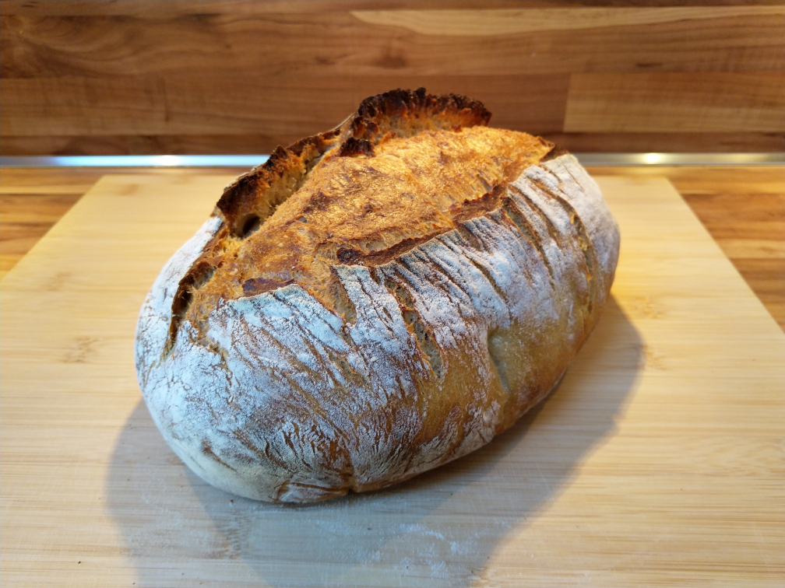

# Rustikales Weizenmischbrot
Teigausbeute: 171

## Zutaten
* 40% Weizenmehl Type 550
* 30% Weizenmehl Type 1050
* 30% Roggenmehl Type 1150 (komplett zu versäuern)
* 71% Wasser
* 1,8% Salz

## Zubereitung
* Zutaten des Hauptteigs vermischen und 1 Stunde ruhen lassen
* Hauptteig und Sauerteig verkneten
* 1,5 Stunden gehen lassen, dabei nach 30 Minuten und 1 Stunde dehnen und falten
* Gusseisener Topf mit Deckel zusammen mit Ofen auf 250°C (Ober- und Unterhitze) vorheizen
* Laib formen und ca. 1 Stunde im Gärkorb gehen lassen
* Laib mit Backpapier-Schlinge in Topf heben
* Laib über gesammte Länge einschneiden
* 45 Minuten backen, nach 10 Minuten Temperatur auf 230°C absenken, nach weiteren 20 Minuten Deckel entfernen
* Brot auf einem Rost abkühlen lassen

## Beispielrechnung mit 900g Mehl und einstufiger Führung
Sauerteigführung über 16 Stunden bei 30°C abfallend auf Zimmertemperatur

### Sauerteig (TA180)
* 259g Roggenmehl Type 1150
* 205g Wasser
* 22g Anstellgut (TA200)

### Hauptteig
* 360g Weizenmehl Type 550
* 270g Weizenmehl Type 1050
* 423g Wasser
* 16,2g Salz
