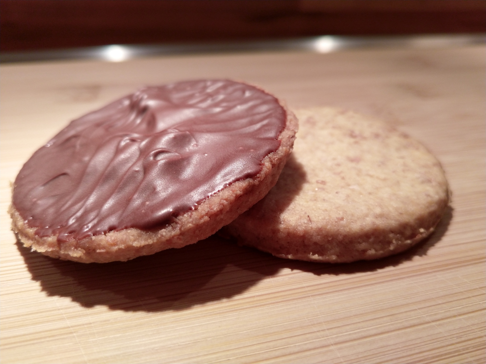

# Digestives
Genug für 16 Kekse

## Zutaten
* 125g Weizenmehl Type 405
* 55g Vollkornweizenmehl
* 60g Zucker
* 2g Natron
* 1g Backpulver
* 0,5g Salz
* 115g kalte Butter in Würfeln
* 55g Buttermilch

## Zubereitung
* Backoven auf 180°C (Unter- und Oberhitze) vorheizen
* Mehl, Zucker, Natron, Backpulver und Salz vermengen
* Zusammen mit der Butter im Zerkleinerer oder Standmixer zu einem losen Pulver verarbeiten (macht die Plätzchen schön sandig)
* Erst jetzt mit der Buttermilch einen klumpigen Teig herstellen
* Teig kurz zusammenkneten
* Auf einer bemehlten Oberfläche dünn ausrollen (4-5mm) und mit runden Förmchen (ca. 7cm) ausstechen
* Kekse einem Blech mit Backpapier verteilen und mit einer Gabel verfach einstechen
* Im Ofen hellbraun backen (ca. 20 Minuten)
* Nach Belieben auf der Unterseite mit Schokolade bestreichen
