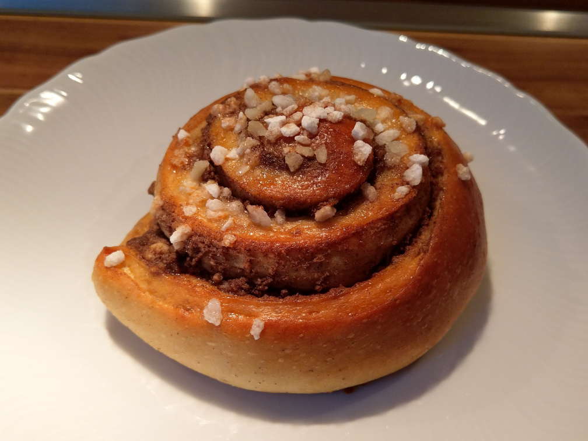

# Kanelbullar
8 Stück

## Zutaten
4g Trockenhefe
30g Wasser (warm)
125g Milch (warm)
285g Weizenmehl Type 550
45g Zucker
1,5g Salz
2,5g Grüne Kardamomsamen (gemahlen)
1 Ei (etwas für die Eistreiche aufheben)
55g Butter (weich)

### Füllung
100g Marzipan
5g Vanillazucker
15g Ceylon-Zimt
75g Butter (weich)

## Zubereitung
* Hefe in Wasser auflösen und mit Milch und Ei vermischen
* Mehl, Zucker, Salz und Kardamom vermengen
* Alles grob verkneten und 20 Minuten ruhen lassen
* Weiterkneten und Butter nach und nach hinzufügen
* 20 Minuten gehen lassen
* Füllung zubereiten
* Teig ausrollen, ca 3-4mm dick, 60cm breit
* Teig mit Füllung besteichen und zusammenrollen
* In 8 Stücke aufteilen und auf Backblech 2h gehen lassen
* Mit Eistreiche abglänzen und mit Hagelzucker bestreuen
* Bei 200°C für 10-15 Minuten backen
* Mit Zuckerglasur dekorieren
